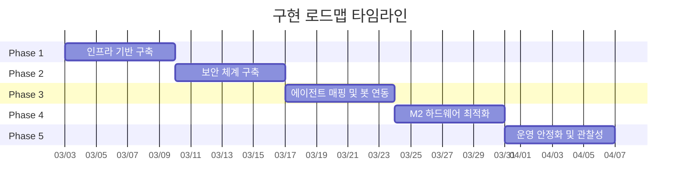

# Project Plan — DomClaw v2026.2

## 구현 로드맵

---

### Phase 1: 인프라 기반 구축

> 목표: Docker Compose 스택으로 Tailscale + Traefik + OpenClaw Gateway를 하나의 네트워크로 통합

| 태스크 | 산출물 | 상태 |
|---|---|---|
| Docker Compose 파일 작성 | `docker-compose.yml` | ✅ |
| Tailscale 컨테이너 설정 | `config/tailscale-serve.json`, named volume | ✅ |
| Traefik 기본 구성 | `traefik.yml` + `dynamic.yml` (미들웨어) | ✅ |
| OpenClaw Gateway 컨테이너 설정 | Docker 라벨, 볼륨 마운트, 헬스체크 | ✅ |
| 환경변수 템플릿 | `.env.example` | ✅ |
| 네트워크 통합 테스트 | Tailscale 망 내 Traefik → Gateway 통신 확인 | ⬜ |

---

### Phase 2: 보안 체계 구축 (Zero-Trust)

> 목표: 외부 포트 0개 노출, 기기 인증 기반 관리자 접근, Bot Token 기반 외부 연동

| 태스크 | 산출물 | 상태 |
|---|---|---|
| Tailscale Funnel 활성화 | HTTPS 외부 엔드포인트 생성 | ⬜ |
| Traefik 라우터 설정 — Public | `Host()` 규칙으로 Discord 웹훅 도메인 매핑 | ⬜ |
| Traefik 라우터 설정 — Admin | 사설망 전용 대시보드 라우팅 | ⬜ |
| IP AllowList 미들웨어 | Discord/Telegram 공식 IP 대역 필터링 | ⬜ |
| non-root 컨테이너 실행 확인 | `user: "1000:1000"` 검증 | ⬜ |
| 보안 접근 테스트 | 사설망 외부에서 Admin 접근 차단 확인 | ⬜ |

---

### Phase 3: 에이전트 매핑 및 봇 연동

> 목표: 프로젝트(채널)별 1:1 에이전트 할당 및 Discord/Telegram 봇 연동

| 태스크 | 산출물 | 상태 |
|---|---|---|
| `config.json` 바인딩 스키마 정의 | 채널-에이전트 매핑 구조 | ⬜ |
| Resonode 전용 에이전트 설정 | `resonode-expert` 바인딩 | ⬜ |
| Solana Guardian 에이전트 설정 | `solana-guardian` 바인딩 | ⬜ |
| Discord Bot Token 연동 | 웹훅 수신 → OpenClaw 라우팅 | ⬜ |
| 채널별 권한 설정 | `requireMention`, `allowlist` 옵션 | ⬜ |
| 봇 응답 E2E 테스트 | Discord → Funnel → Traefik → Gateway → 응답 | ⬜ |

---

### Phase 4: M2 하드웨어 최적화

> 목표: 16GB/24GB RAM 환경에서 안정적 다중 에이전트 운영

| 태스크 | 산출물 | 상태 |
|---|---|---|
| Docker 리소스 제한 설정 | `deploy.resources.limits.memory` | ⬜ |
| 에이전트당 2GB 메모리 쿼터 검증 | 부하 테스트 결과 | ⬜ |
| 컨테이너 그룹화 최적화 | 단일 게이트웨이 = 다중 봇 아키텍처 | ⬜ |
| OOM 방어 테스트 | 5개 에이전트 동시 실행 + 메모리 모니터링 | ⬜ |
| 성능 벤치마크 문서화 | 메모리/CPU 사용량 기준 | ⬜ |

---

### Phase 5: 운영 안정화 및 관찰성

> 목표: 자동 복구, 로깅, 대시보드 모니터링 체계 완성

| 태스크 | 산출물 | 상태 |
|---|---|---|
| 컨테이너 자동 재시작 설정 | `restart: unless-stopped` | ⬜ |
| Traefik 대시보드 접근 설정 | 사설망 전용 라우팅 | ⬜ |
| 로그 수집 구조 설정 | Docker 로깅 드라이버 | ⬜ |
| 운영 매뉴얼 작성 | 장애 대응, 에이전트 추가/제거 절차 | ⬜ |
| 최종 통합 테스트 | 전체 아키텍처 검증 | ⬜ |

---

## 주요 마일스톤

---

## 산출물 체크리스트

- [ ] `docker-compose.yml` — 전체 컨테이너 오케스트레이션
- [ ] `traefik.yml` — Traefik 상세 설정
- [ ] `config.json` — 에이전트 바인딩 매핑
- [ ] `.env.example` — 환경변수 템플릿
- [ ] 보안 테스트 보고서
- [ ] 성능 벤치마크 보고서
- [ ] 운영 매뉴얼

---

## 리스크 및 대응

| 리스크 | 영향 | 대응 방안 |
|---|---|---|
| M2 메모리 부족 (16GB) | 에이전트 OOM 종료 | Docker 메모리 제한 + 에이전트 수 조절 |
| Tailscale Funnel 지연 | 봇 응답 지연 | 대기열 버퍼 + 타임아웃 설정 |
| Discord IP 대역 변경 | 웹훅 수신 실패 | AllowList 자동 업데이트 스크립트 |
| Docker Desktop 리소스 경합 | 전체 시스템 성능 저하 | VM 리소스 상한 설정 (Docker 설정) |