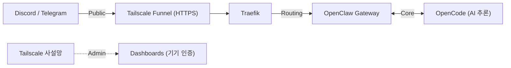

# Product Requirements Document (PRD)

## DomClaw — OpenClaw 에이전트 인프라 v2026.2

---

## 1. 제품 비전

M2 MacBook Pro 환경에서 **여러 AI 에이전트 프로젝트를 안전하고 효율적으로 동시 운영**할 수 있는 개인용 인프라 플랫폼. 단순한 설치를 넘어, 하드웨어 성능을 극대화하면서도 보안을 놓치지 않는 '개인용 AI 에이전트 인프라' 구축이 목표입니다.

---

## 2. 대상 사용자

| 페르소나 | 니즈 |
|---|---|
| **1인 개발자 / 인디해커** | 여러 AI 프로젝트를 한 대의 맥북에서 안전하게 동시 운영 |
| **크립토 개발자** | Solana 등 블록체인 프로젝트에 전용 보안 에이전트 배치 |
| **팀 리더** | Discord 채널별 전문 에이전트를 할당하여 프로젝트 컨텍스트 분리 |

---

## 3. 핵심 기능 요구사항

### 3.1 다중 에이전트 라우팅

- **FR-01:** Traefik을 통한 도메인 기반 지능형 라우팅
- **FR-02:** 프로젝트(채널)별 1:1 에이전트 매핑 (`config.json` 바인딩)
- **FR-03:** 단일 OpenClaw Gateway 내에서 다중 봇 동시 실행

### 3.2 보안 및 접근 제어 (Zero-Trust)

- **FR-04:** Tailscale 기기 인증으로 관리자 대시보드 접근 (ID/PW 불필요)
- **FR-05:** Traefik IP AllowList 미들웨어로 Discord/Telegram 공식 IP만 허용
- **FR-06:** Tailscale Funnel을 통한 안전한 HTTPS 외부 엔드포인트

### 3.3 M2 하드웨어 최적화

- **FR-07:** 에이전트당 메모리 사용량 2GB 이하 제한 (Docker resource limits)
- **FR-08:** 전체 게이트웨이 메모리 4GB 이내 운영
- **FR-09:** 개별 프로젝트마다 컨테이너를 띄우지 않고, 단일 게이트웨이 그룹화

### 3.4 외부 서비스 연동

- **FR-10:** Discord 봇 웹훅 연동 (Tailscale Funnel → Traefik → OpenClaw)
- **FR-11:** Telegram 봇 연동 지원
- **FR-12:** OpenCode AI 추론 엔진과의 양방향 통신

### 3.5 운영 및 관찰성(Observability)

- **FR-13:** Traefik 대시보드를 통한 라우팅 상태 모니터링
- **FR-14:** OpenClaw 대시보드를 통한 에이전트 상태 확인
- **FR-15:** Docker 리소스 사용량 모니터링

---

## 4. 비기능 요구사항

### 4.1 성능

| 항목 | 기준 |
|---|---|
| API 응답 시간 | < 200ms (라우팅 레이어) |
| 동시 에이전트 수 | 최소 5개 프로젝트 동시 운영 |
| 메모리 사용량 | 전체 시스템 8GB 이내 (OS 포함) |
| 콜드 스타트 | < 30초 (docker compose up) |

### 4.2 보안

| 항목 | 기준 |
|---|---|
| 외부 포트 노출 | 0개 (Tailscale Funnel로 대체) |
| 관리자 인증 | 기기 기반 (Tailscale ACL) |
| 봇 통신 | TLS 종단 암호화 |
| 컨테이너 권한 | non-root 실행 (`user: "1000:1000"`) |

### 4.3 운영 안정성

| 항목 | 기준 |
|---|---|
| 컨테이너 자동 복구 | `restart: unless-stopped` |
| 상태 영속성 | Tailscale state, OpenClaw config 볼륨 마운트 |
| 로그 보존 | Docker 기본 로깅 드라이버 활용 |

---

## 5. 시스템 아키텍처

---

## 6. 주요 구성 요소

| 구성 요소 | 이미지 | 역할 |
|---|---|---|
| Tailscale | `tailscale/tailscale:latest` | Zero-Trust 네트워킹, Funnel |
| Traefik | `traefik:v3.0` | 도메인 기반 라우팅, 미들웨어 |
| OpenClaw Gateway | `phioranex/openclaw-gateway:latest` | 에이전트 실행, 봇 매핑 |

---

## 7. 성공 지표

| 지표 | 목표 |
|---|---|
| 인프라 가동률 | 99% (개인 환경 기준) |
| 에이전트 응답 성공률 | > 95% |
| 메모리 OOM 발생 | 0건 / 월 |
| 보안 인시던트 | 0건 / 분기 |

---

## 8. 운영 전략 요약

| 구분 | 전략 | 기대 효과 |
|---|---|---|
| **인프라** | Traefik + Tailscale | 외부 포트 개방 없는 안전한 도메인 매핑 |
| **인증** | Tailscale Device Auth | 관리자용 로그인 절차 생략 및 보안 극대화 |
| **성능** | M2 Resource Limit | 램 부족으로 인한 시스템 버벅임 방지 |
| **확장** | 1:1 Bot Mapping | 프로젝트 간 컨텍스트 분리 및 전문성 향상 |