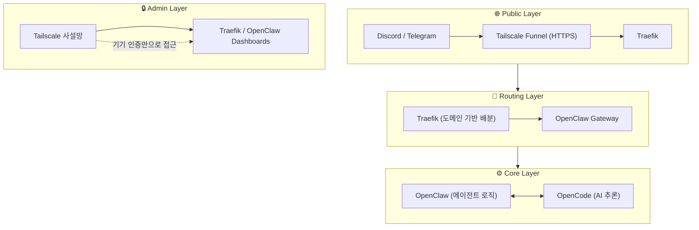

# 🛸 DomClaw — OpenClaw 에이전트 인프라 (v2026.2)

> M2 MacBook Pro 환경에서 여러 프로젝트(Resonode, Remogent, Solana 등)를 안전하고 효율적으로 동시 운영하기 위한 **개인용 AI 에이전트 인프라**.

---

## 시스템 아키텍처 개요

전체 트래픽은 보안 계층을 거쳐 프로젝트별 에이전트로 정밀하게 라우팅됩니다.



---

## 핵심 기술 스택

| 구성 요소 | 역할 | 비고 |
|---|---|---|
| **OpenClaw Gateway** | 에이전트 로직 실행 및 봇 1:1 매핑 | 단일 게이트웨이로 다중 프로젝트 운영 |
| **Traefik v3** | 도메인 기반 지능형 라우터 | Docker 라벨 기반 자동 설정 |
| **Tailscale** | Zero-Trust 네트워킹 + Funnel | 외부 포트 개방 없는 HTTPS 엔드포인트 |
| **OpenCode** | AI 추론 엔진 | OpenClaw와 연동 |

---

## 빠른 시작

### 사전 요구사항

- **M2 MacBook Pro** (16GB+ RAM 권장)
- Docker Desktop 설치 및 실행
- Tailscale 계정 및 Auth Key
- Discord Bot Token (봇 연동 시)

### 설치 및 실행

```bash
# 1. 저장소 클론
git clone https://github.com/epicsagas/domclaw.git
cd domclaw

# 2. 환경 변수 설정
cp .env.example .env
# .env 파일을 편집하여 TS_KEY, DISCORD_TOKEN 등 설정

# 3. 컨테이너 실행
docker compose up -d

# 4. 상태 확인
docker compose ps
docker compose logs -f openclaw-gateway
```

---

## 핵심 구성 파일

### `docker-compose.yml`

```yaml
services:
  # 네트워크 및 보안 게이트웨이
  tailscale:
    image: tailscale/tailscale:latest
    hostname: ai-commander
    environment:
      - TS_AUTHKEY=${TS_KEY}
      - TS_STATE_DIR=/var/lib/tailscale
    volumes:
      - ./tailscale/state:/var/lib/tailscale
      - /dev/net/tun:/dev/net/tun
    cap_add:
      - NET_ADMIN
      - SYS_MODULE

  # 도메인 기반 지능형 라우터
  traefik:
    image: traefik:v3.0
    network_mode: "service:tailscale"
    volumes:
      - /var/run/docker.sock:/var/run/docker.sock:ro
      - ./traefik.yml:/etc/traefik/traefik.yml

  # 메인 에이전트 엔진
  openclaw-gateway:
    image: phioranex/openclaw-gateway:latest
    user: "1000:1000"
    deploy:
      resources:
        limits:
          memory: 4G
    labels:
      - "traefik.enable=true"
      - "traefik.http.routers.bot-public.rule=Host(`agent.your-tailnet.ts.net`)"
      - "traefik.http.routers.admin.rule=Host(`admin.internal`)"
    volumes:
      - ~/.openclaw:/home/node/.openclaw
      - ~/projects:/workspace/projects:rw
```

### `config.json` — 프로젝트별 1:1 봇 매핑

```json
{
  "bindings": [
    {
      "comment": "Resonode 개발 메인 에이전트",
      "match": { "channel": "discord", "channelId": "111222333" },
      "agentId": "resonode-expert",
      "options": { "requireMention": true }
    },
    {
      "comment": "Solana 보안 및 트랜잭션 알림",
      "match": { "channel": "discord", "channelId": "444555666" },
      "agentId": "solana-guardian",
      "options": { "allowlist": ["@crypto-lead"] }
    }
  ]
}
```

---

## 보안 모델 (Zero-Trust)

### 관리자 접근 (Admin Access)
- **방식:** Tailscale 기기 인증
- Tailscale이 켜진 내 맥북/데스크탑에서만 대시보드 접속 가능
- ID/PW 불필요 → Authelia 등 별도 인증 게이트 불필요 → 리소스 절약

### 외부 연동 (Public Access)
- **방식:** Traefik IP AllowList + Bot Token
- 외부 노출은 Discord/Telegram 공식 IP 대역만 허용
- Traefik 미들웨어에서 필터링

---

## M2 하드웨어 최적화

| 전략 | 설정 | 효과 |
|---|---|---|
| 컨테이너 그룹화 | 단일 게이트웨이 내 다중 봇 운영 | VM 오버헤드 최소화 |
| 리소스 쿼터 | 에이전트당 2GB 이하 제한 | 램 부족으로 인한 시스템 버벅임 방지 |
| 통합 네트워크 | Tailscale 네트워크 모드 공유 | 네트워크 스택 중복 제거 |

---

## 로드맵

- **Phase 1:** 인프라 기반 구축 — Docker Compose, Tailscale, Traefik 통합
- **Phase 2:** 에이전트 연동 — OpenClaw Gateway + 프로젝트별 봇 매핑
- **Phase 3:** 보안 강화 — IP AllowList, Zero-Trust 접근 제어 완성
- **Phase 4:** 확장 — Remogent, Solana Guardian 등 신규 에이전트 추가

---

## 라이선스

MIT