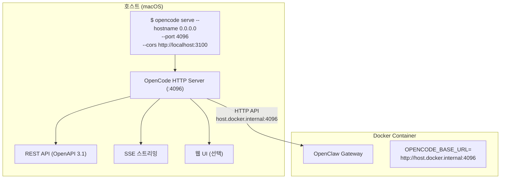

# Host OpenCode 연동 가이드

**작성일**: 2026-02-27  
**버전**: v2026.2

---

## 개요

DomClaw는 OpenCode를 **Docker 컨테이너 대신 호스트에서 직접 실행**하여 연동합니다. 이 방식의 장점:

- ✅ Docker 이미지 Pull 문제 해결
- ✅ 호스트의 기존 OpenCode 설정 활용
- ✅ Tailscale과 OpenCode Companion App 연동 유지
- ✅ 더 안정적인 성능

---

## 아키텍처



---

## 실행 방법

### 1. OpenCode HTTP 서버 시작

```bash
# 방법 1: 헤드리스 서버 (CLI만)
opencode serve --hostname 0.0.0.0 --port 4096 --cors http://localhost:3100

# 방법 2: 웹 UI 포함
opencode web --hostname 0.0.0.0 --port 4096 --cors http://localhost:3100

# 방법 3: 인증 추가
OPENCODE_SERVER_PASSWORD=your-password opencode serve \
  --hostname 0.0.0.0 --port 4096 --cors http://localhost:3100
```

### 2. DomClaw 스택 시작

```bash
# 환경 변수 설정
cp .env.example .env
# .env 편집

# 스택 시작
./domclaw up
```

---

## OpenCode API 엔드포인트

| 엔드포인트 | 기능 |
|---|---|
| `GET /doc` | OpenAPI 3.1 스펙 |
| `POST /session` | 세션 생성 |
| `GET /session/{id}` | 세션 조회 |
| `POST /session/{id}/message` | 메시지 전송 |
| `GET /event` | SSE 실시간 이벤트 |
| `GET /model` | 모델 목록 |
| `GET /config` | 설정 조회 |

---

## 명령어 옵션

| 옵션 | 설명 | 기본값 |
|---|---|---|
| `--port` | HTTP 서버 포트 | `4096` |
| `--hostname` | 바인딩 호스트 | `127.0.0.1` |
| `--cors` | CORS origin 허용 | `[]` |
| `--mdns` | mDNS 디스커버리 | `false` |

---

## 인증

```bash
# 환경 변수로 설정
export OPENCODE_SERVER_PASSWORD=your-password
export OPENCODE_SERVER_USERNAME=opencode  # 선택

opencode serve --hostname 0.0.0.0 --port 4096
```

HTTP Basic Auth가 활성화되면 모든 API 요청에 인증이 필요합니다.

---

## 문제 해결

### 컨테이너에서 호스트 접근 불가

```bash
# macOS에서 host.docker.internal 확인
docker run --rm alpine ping host.docker.internal

# 방화벽 확인
# 시스템 환경설정 > 보안 및 개인 정보 보호 > 방화벽
```

### CORS 에러

```bash
# CORS origin 추가
opencode serve --hostname 0.0.0.0 --port 4096 \
  --cors http://localhost:3100 \
  --cors http://localhost:8765
```

### 포트 충돌

```bash
# 다른 포트 사용
opencode serve --hostname 0.0.0.0 --port 4097

# .env에서 포트 변경
OPENCODE_PORT=4097
```

---

## 참고 자료

- [OpenCode Server 문서](https://opencode.ai/docs/server/)
- [OpenCode SDK 문서](https://opencode.ai/docs/sdk/)
- [OpenAPI 스펙](http://localhost:4096/doc) (서버 실행 후)
