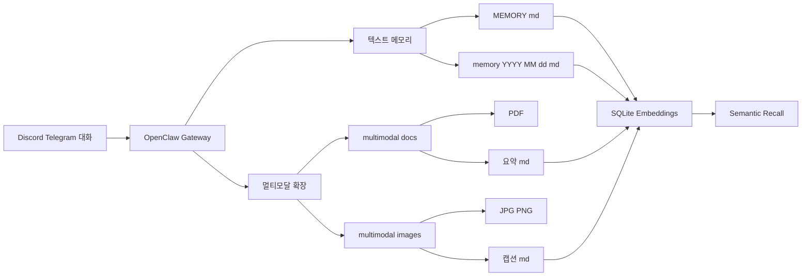

# OpenClaw 장기 메모리 시스템 분석

**분석일**: 2026-02-27
**대상**: DomClaw 프로젝트 OpenClaw Gateway 메모리 시스템

---

## 요약

OpenClaw는 **파일 기반 장기 메모리 시스템**을 내장하고 있으며, 텍스트/MD는 기본 지원, PDF/이미지는 확장을 통해 통합 가능합니다.

---

## 1. OpenClaw 메모리 시스템 개요

### 핵심 원리

OpenClaw 메모리는 **평범한 Markdown 파일**이 유일한 진실의 원천(Source of Truth)입니다.

```
workspace/
├── MEMORY.md              # 장기 기억 (커리어된 팩트, 결정)
└── memory/
    └── YYYY-MM-DD.md       # 일일 로그 (전용 세션)
```

### 메모리 레이어

| 레이어 | 파일 | 용도 | 로드 타이밍 |
|---|---|---|---|
| **장기 기억** | `MEMORY.md` | 안정된 팩트, 선호사항, 결정 | 세션 시작시 |
| **일일 로그** | `memory/2026-02-27.md` | 하루 종일 노트, 실행 컨텍스트 | 오늘 + 어제 |

### 검색 툴

OpenClaw가 에이전트에 제공하는 2가지 툴:

```javascript
// 1. 파일 직접 읽기
memory_get({ file: "MEMORY.md" })

// 2. 시멘틱 검색 (인덱싱된 스니펫)
memory_search({ query: "어제 먹은 것", topK: 3 })
```

---

## 2. 기존 기능 (기본 지원)

### ✅ 대화 문답 저장

- **자동 기록**: 에이전트가 세션 중에 자동으로 일일 로그에 기록
- **파일**: `memory/YYYY-MM-DD.md`
- **형식**: Markdown, append-only

### ✅ 텍스트 저장

- **형식**: Markdown
- **위치**: Workspace 내 `MEMORY.md`와 `memory/` 디렉토리
- **버전 관리**: Git으로 가능 (휴먼 리더블)

### ✅ MD 파일 저장

- **파일**: `MEMORY.md`
- **용도**: 커리어된 장기 기억
- **접근**: 세션 시작시 자동 로드

### ✅ 상관 분석

- **방식**: Semantic search (`memory_search` 툴)
- **구현**: SQLite + embeddings
- **검색**: 하이브리드 (벡터 + 키워드)

### ✅ 빠른 검색

- **인덱싱**: SQLite + embeddings 캐시
- **알고리즘**: 하이브리드 검색
  - 벡터: 의미적 유사도
  - 키워드: 정확 매칭
- **결과**: 관련성 높은 메모리 우선 정렬

---

## 3. 확장 가능성 (PDF/이미지)

### ⚠️ PDF 저장

- **기본 지원**: 안됨
- **확장**: 가능
- **접근 방안**: PDF 텍스트 추출 → Markdown으로 저장 → 기존 시멘틱 검색 활용

### ⚠️ 이미지 저장

- **기본 지원**: 안됨
- **확장**: 가능
- **접근 방안**: 이미지 캡션/메타데이터 추출 → Markdown으로 저장 → 시멘틱 검색

---

## 4. 권장 아키텍처



### 디렉토리 구조 (확장 포함)

```
workspace/
├── MEMORY.md                    # 텍스트 장기 기억 (기본)
├── memory/
│   └── 2026-02-27.md          # 일일 로그 (기본)
└── multimodal/                  # 멀티모달 확장
    ├── docs/
    │   ├── document1.pdf
    │   └── summary1.md          # PDF 텍스트 추출 결과
    └── images/
        ├── photo1.jpg
        └── caption1.md          # 이미지 캡션/메타데이터
```

---

## 5. 구현 방법

### 5.1 텍스트/MD (기본 지원)

OpenClaw가 자동 관리하므로 별도 구현 불필요:

```javascript
// OpenClaw 툴 사용
memory_get({ file: "MEMORY.md" })
memory_search({ query: "무엇을 먹었는지", topK: 3 })
```

### 5.2 PDF 처리 (확장)

#### 파이프라인

```bash
# 1. PDF → Markdown 변환
pdfplumber document1.pdf > workspace/multimodal/docs/summary1.md

# 2. 메타데이터 포맷
cat > workspace/multimodal/docs/summary1.md <<EOF
---
Source: document1.pdf
Type: PDF
Timestamp: 2026-02-27T15:48:00Z
Tags: report, q1
---

# 문서 요약

(추출된 텍스트 내용)
EOF
```

#### 추천 라이브러리

| 라이브러리 | 언어 | 특징 |
|---|---|---|
| `pdfplumber` | Python | 빠른 텍스트 추출, 테이블 보존 |
| `PyPDF2` | Python | 가볍고 안정적 |
| `pdf.js` | JavaScript | 브라우저 사용 가능 |

### 5.3 이미지 처리 (확장)

#### 파이프라인

```bash
# 1. 이미지 → 캡션 생성 (BLIP-2, CLIP)
python -m generate_caption photo1.jpg > workspace/multimodal/images/caption1.md

# 2. 메타데이터 포맷
cat > workspace/multimodal/images/caption1.md <<EOF
---
Source: photo1.jpg
Type: Image
Caption: 근무 시간에 찍은 데스크탑 스크린샷
Timestamp: 2026-02-27T15:48:00Z
Tags: work, screenshot, desktop
---

사용자가 오픈클로 메모리 시스템을 분석하고 있음
EOF
```

#### 추천 모델

| 모델 | 특징 | 용도 |
|---|---|---|
| **BLIP-2** | 텍스트 생성, 질문 답변 | 이미지 캡션 |
| **CLIP** | 텍스트-이미지 유사도 | 시멘틱 검색 |
| **LLaVA** | 대화형 이미지 이해 | 복잡한 이미지 설명 |

---

## 6. 검색 최적화

### OpenClaw 하이브리드 검색

기본 내장된 시멘틱 검색 알고리즘:

| 구성 | 역할 |
|---|---|
| **벡터 검색** | 의미적 유사도 (임베딩 코사인 유사도) |
| **키워드 검색** | 정확 매칭 (BM25 등) |
| **결과 정렬** | 관련성 높은 메모리 우선 |

### 확장 패턴 (PDF/이미지)

Markdown 형식으로 저장하면 자동으로 인덱싱됨:

```markdown
<!-- workspace/multimodal/images/caption1.md ---
Source: photo1.jpg
Caption: 근무 시간에 찍은 데스크탑 스크린샷
Timestamp: 2026-02-27T15:48:00Z
Tags: work, screenshot, desktop
---

사용자가 오픈클로 메모리 시스템을 분석하고 있음
```

---

## 7. 추천 기술 스택

### 저장 및 검색

| 구성 요소 | 도구 | 이유 |
|---|---|---|
| **벡터 DB** | OpenClaw 내장 SQLite | 이미 통합, 별도 컨테이너 불필요 |
| **임베딩 생성** | OpenAI/Claude API | 고품질 시멘틱 임베딩 |
| **스토리지** | Workspace 파일 시스템 | Git 관리 가능, 휴먼 리더블 |

### PDF 처리

| 구성 요소 | 도구 | 이유 |
|---|---|---|
| **텍스트 추출** | `pdfplumber` (Python) | 빠른 추출, 테이블 보존 |
| **청킹** | `langchain-text-splitters` | 시멘틱 청킹 |

### 이미지 처리

| 구성 요소 | 도구 | 이유 |
|---|---|---|
| **캡션 생성** | `BLIP-2` / `CLIP` | 멀티모달 임베딩 생성 |
| **메타데이터** | EXIF 추출 (Python `PIL`) | 타임스탬프, 위치 정보 |

---

## 8. 에이전트 설정 예시

### `config/agents.json` 확장

```json
{
  "id": "memory-agent",
  "name": "Memory Enhanced Agent",
  "workspace": "/workspace/domclaw/memory",
  "memory": {
    "enabled": true,
    "maxTokens": 100000,
    "embeddingModel": "text-embedding-3-small",
    "multimodal": {
      "pdf": {
        "enabled": true,
        "extractor": "pdfplumber"
      },
      "images": {
        "enabled": true,
        "captioner": "blip2"
      }
    }
  },
  "tools": [
    { "name": "memory_get", "enabled": true },
    { "name": "memory_search", "enabled": true },
    { "name": "file-read", "enabled": true },
    { "name": "file-write", "enabled": true },
    { "name": "terminal", "enabled": true }
  ]
}
```

---

## 9. 결론

### ✅ 가능 여부

**가능합니다.** OpenClaw는 이미 장기 메모리 시스템을 갖추고 있으며, 확장을 통해 PDF/이미지도 통합할 수 있습니다.

### 핵심 이점

| 이점 | 설명 |
|---|---|
| **상관 분석** | Semantic search로 자동 수행 |
| **속도** | SQLite 인덱싱으로 빠른 검색 |
| **OpenClaw 연동** | 이미 내장, 별도 서버 불필요 |
| **멀티모달** | 확장 가능한 아키텍처 |
| **휴먼 리더블** | Markdown으로 버전 관리 가능 |

### 다음 단계

1. ✅ 텍스트/MD: 즉시 사용 가능 (기본 지원)
2. 🔄 PDF 처리: 확장 스크립트 작성
3. 🔄 이미지 처리: 확장 스크립트 작성
4. 📊 대시보드: 검색 결과 시각화

---

## 참고 자료

- [OpenClaw Memory 공식 문서](https://docs.openclaw.ai/concepts/memory)
- [How OpenClaw Implements Agent Memory](https://www.mmntm.net/articles/openclaw-memory-architecture)
- [OpenClaw Gateway Architecture](https://docs.openclaw.ai/concepts/architecture)

---

**작성일**: 2026-02-27
**분석자**: DomClaw 프로젝트 분석
